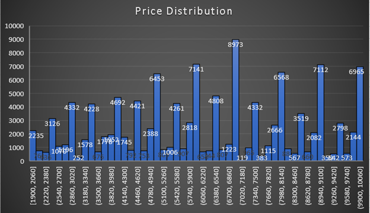
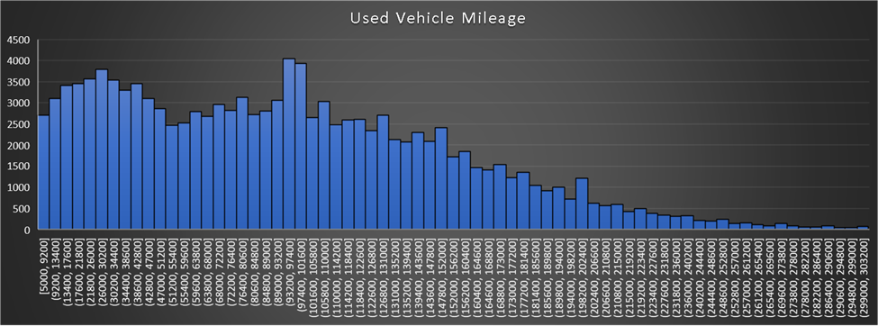

# Analysing the Used Car Market on Craigslist
"Craigslist Used Cars Data Analysis (April-May 2021): Insights and Excel Techniques"

Data collected by Austin Reese, analysis by Joshua Porter

Created with Excel, to find the excel spreadsheet and analysis, follow the dropbox link and download the sheet: 

https://www.dropbox.com/scl/fi/ekb5gfv75agdf7xn29s9b/vehicles.xlsb.xlsx?rlkey=m9ebougpreyiad1fviwmt0a6y&dl=0

Source: https://www.kaggle.com/datasets/austinreese/craigslist-carstrucks-data/code

When I first opened this large dataset, after noticing how large it was, I took a breath and began to explore just the column attributes and form SMART questions to investigate further.

## SMART Questions: 

### Price Analysis:

 What is the average price of used cars by manufacturer for the data timeframe?

### Regional Trends:

 Which region had the highest number of used cars posted for the data timeframe?

 
### Condition Impact:

Specific: 

What is the impact of car condition (e.g., like new, good, fair) on the selling price
for cars within a specific age range (e.g., 5-10 years)?

Measurable: 

Analyze price variations based on condition.

Achievable:

Needs data on car condition and age.

Relevant: 

Helps in pricing cars based on condition.

Time-bound:

Focus on a specific age range of cars.

### Manufacturer Popularity: 

Which car manufacturer was listed the most on Craigslist during this dataset's timeframe?
Model-specific Trends:  For a particular car model (i.e. Honda, Toyota, Infiniti, etc.), how does the listing price vary across regions?

---------------------------------------------------------------------------------------------------

## Pro tip: You can make the top row visible at all times by following the instructions below for Excel

Select the Row Below the One You Want to Freeze:

Click on the row number just below the row you want to keep visible. For example, if you want to freeze the top row, click on the second row.
Use the Freeze Panes Option:

Go to the View tab on the Excel ribbon.
In the Window group, you will find the Freeze Panes button.
Click on Freeze Panes, and a dropdown menu will appear.
Select Freeze Top Row to freeze the first row. If you have selected a different row, choose Freeze Panes from the dropdown.
Scroll Through Your Sheet:

Once you've frozen the top row, you can scroll through your spreadsheet, and the top row will remain visible at all times.
Unfreeze Panes:

If you need to unfreeze the panes later, just go back to View > Freeze Panes and select Unfreeze Panes.

----------------------------------------------------

After I made some questions, I wanted to find any immediate patterns, make sure the data is properly formatted, and find errors. I found that although this dataset had a “Usability” score of over 9.5 on Kaggle, which gave me the opportunity to clean it.

Some things I noticed: 
* The first 28 rows were missing 20 of the 26 columns for analysis.  For simplicity of analysis, I removed them from the dataset.

* The price for cars seems to be mismatched as well. There is no way a 1997 Toyota is going to be $123,456. There are several of these even below 100,000. I chose to remove all entries with a car > $10,000 or < $1,900. Cars less than $1900 tend to be cars in good, excellent, or like new condition which is unrealistic for a car that is <$1900. While it is sad to see all the legit postings get erased too, I do not have the technical skills yet to be able to differentiate them. This will also make my data set more manageable and has brought the average price down from over $120k down to $6,015 which is more reasonable for a used car market. 
$1900 < used car < $10,000

* The odometer reading for some cars is not accurate, likely due to errors in recording by the craigslist posters. Some odometer rows say 123456, 1, 7, 999999, or 500 which are likely errors. This will skew my average and will alter data visualizations so I will only include cars with odometer values 5000 < odometer value < 700,0000 and where odometer =/= 123456. *Later found that some entries for odometer were blank so I put the average value in for the few that were blank
For all entries where the manufacturer is not listed, I put “Unlisted”

We now have cleaned rows of data we can analyze to discover insights from our range of used cars posted to craigslist in the U.S. in April and May 2021.

## Analyzing Price and Mileage Distribution
----------------------------
Excel functions used:
Average 		=ROUND(AVERAGE(vehicles!E2:E123567), 2)

Median 		=MEDIAN(vehicles!E2:E123567)

Mode 			=MODE.SNGL(vehicles!E2:E123567)

Range 			=MAX(vehicles!E2:E123567) - MIN(vehicles!E2:E123567)   

Variance 		=VAR.S(vehicles!E2:E123567)

Standard Deviation	=STDEV.S(vehicles!E2:E123567)

Additionally, I used the built in add-on for data analysis in Excel called "Descriptive Statistics" to give me additional information like standard error, sample variance, kurtosis, skewness, sum, and count. Though these can be calculated and formatted manually, the data analytics add-on provides an efficient alternative. 

#### Analysis of key data points for price: 
The average, median, and mode sit in the 6000 range indicating this is the most frequent price point. Since the median is lower than the mean, it suggests that we have a slight skew in our data which can be seen by our skewness value of -0.0275.
We have a large standard deviation which shows that there is significant distribution of price ranges. Kurtosis is a measure of the distribution compared to the normal distribution where a value of -1.0739 means that it has a flatter peak and longer tails.

#### What is a histogram?
A histogram is a type of graph that represents the distribution of numerical data by showing the number of data points that fall within a range of values, known as bins. The x-axis typically shows the bins (price ranges in this case), while the y-axis represents the frequency of observations within each bin.

[ 	Histogram that shows the distribution of prices within a bin of 160$.	 ]

Looking at the histogram, here are a few things we can see:
It follows an interesting staircase pattern which I believe is the result of people listing their cars as whole thousands like 6000, 7000, etc.
Of cars priced between 1 and 10 thousand, we can see that the most commonly priced is between the range 6861 and 7019.
The prices of lower priced cars tend to have a slightly higher frequency for values that are not whole thousands which may result from the stability of the used car market between 2000 and 4000 dollars. 

#### Analysis of key data points for mileage: 

[	histogram showing mileage of cars between mileage 5k and 300k mi	]

Analysis: Of cars purchased between $1900 and $10000, they are substantially skewed to the right with most cars having less than 300,000 miles which is noted by a high skewness value. Its distribution is very wide and its median gives a slightly more accurate depiction of common prices since there are a few very large outliers even after we cleaned the data to get rid of errors.

I then looked back to some of the questions I made at the beginning and analyzed some of them with my cleaned data.
I created a pivot table to sort regions by their number of car listings, by manufacturers, and I created a joint pivot table that takes the average price by manufacturer.

#### Which region had the most cars sold?
Top  5:

orlando = 2983

sarasota-bradenton = 2977

stockton = 2977

boise = 2976

washington, DC = 2970

#### Which car manufacturer has the most listings? 
Top 5:

ford = 19981

chevrolet = 15292

toyota = 10592

honda = 6274

nissan = 5606

For a more detailed breakdown, see the full analyzed excel spreadsheet which also includes interactive pivot tables.

## Future Analysis Possibilities
There is much more that can be done with this dataset, though Craigslist does not condone scraping its dataset to make a profit which is why I used this as a practice analysis.

More practical, (and time consuming) examples include:

* Advanced Market Analysis (basic market analysis was performed with excel)
  - Create a heatmap of lat/lon positions of car listings
    + Make it so the user can see outputs for different manufacturer/model and price range on the heatmap
  - Scrape the dataset for particularly odd listings like low priced cars with low mileage in excellent condition. Is there a specific region where cars tend to be priced lower?
 
* Predictive modeling
  + Build a model that can predict the price of a car based on its features like manufacturer, model, year, mileage, and condition

* Strategies for a dealership
  + Stocking Decisions: Use the data to inform which cars a dealership should stock based on popularity and selling price in a specific region.

* Pricing Strategy: Develop pricing strategies for dealerships to competitively price their cars based on current market listings.

* Machine learning
  + Anomaly Detection: Identify listings that might be scams or errors by detecting outliers in price or other features.
  + Recommendation Systems: Build a system that recommends cars to users based on their search patterns and preferences.

* Socioeconomic research
  + What influences a region’s used car market, such as income levels, urban versus rural, etc.?
